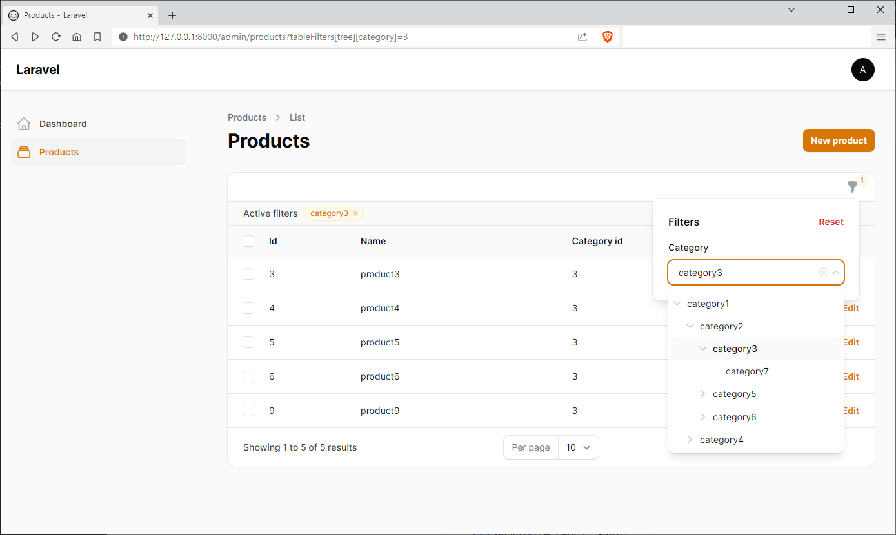

# filamentapp

## Filament Select Tree (by CodeWithDennis) Sample

[codewithdennis-select-tree](https://filamentphp.com/plugins/codewithdennis-select-tree)

[filament-select-tree](https://github.com/codewithdennis/filament-select-tree)

  

```php
// ProductResource.php

use CodeWithDennis\FilamentSelectTree\SelectTree;
use Filament\Forms\Components\TextInput;
use Filament\Tables\Columns\TextColumn;
use Filament\Tables\Filters\Filter;
use App\Models\Category;

class ProductResource extends Resource
{
    protected static ?string $model = Product::class;

    public static function form(Form $form): Form
    {
        return $form
            ->schema([
                TextInput::make('name'),
                SelectTree::make('category_id')
                    ->relationship('category', 'name', 'category_id', function ($query) {
                        return $query;
                    }),
            ]);
    }

    public static function table(Table $table): Table
    {
        return $table
            ->columns([
                TextColumn::make('id')->numeric(),
                TextColumn::make('name'),
                TextColumn::make('category_id')->numeric(),
            ])
            ->filters([
                Filter::make('tree')
                    ->form([
                        SelectTree::make('category')
                            ->relationship('category', 'name', 'category_id')
                            ->independent(false)
                            ->enableBranchNode()
                            // ->alwaysOpen()
                            // ->expandSelected(false) // only works if field is dependent
                            // ->parentNullValue(-1) // default = null
                            // ->defaultOpenLevel(2)
                            // ->direction('top')
                            // ->grouped(false)
                            // ->clearable(false)
                            // ->searchable()
                            ,
                    ])
                    ->query(function (Builder $query, array $data) {
                        return $query->when($data['category'], function ($query, $categories) {
                            return $query->whereHas('category', fn ($query) =>
                                // $query->dd()
                                //"select * from `categories` where `products`.`category_id` = `categories`.`id`"
                                $query->whereIn('id', [ $categories ])
                            );
                        });
                    })
                    ->indicateUsing(function (array $data): ?string {
                        if (!$data['category']) {
                            return null;
                        }
                        return implode(', ', Category::whereIn('id', [ $data['category'] ])->get()->pluck('name')->toArray());
                    })
            ]);
    }
}
```
